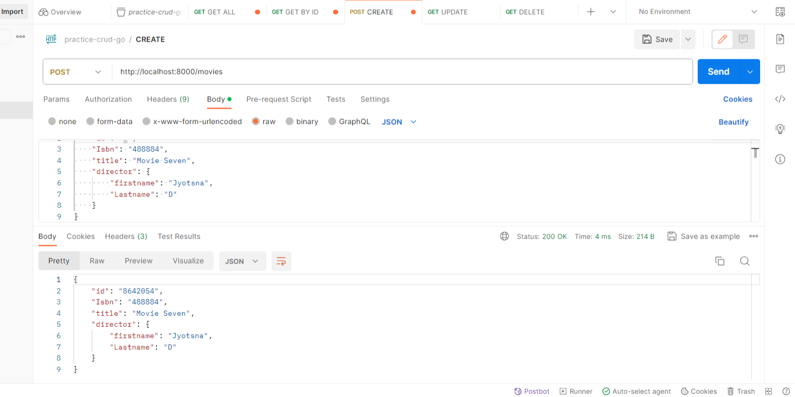

# Movie Database API using Golang

## Overview

This project implements a Movie Database API using Go (Golang) and the [gorilla/mux](https://github.com/gorilla/mux) router. The API allows users to perform basic CRUD operations on a collection of movies.

### Key Features

- **Scalable CRUD Operations:** Perform Create, Read, Update, and Delete operations seamlessly on a collection of movies.
- **RESTful Architecture:** The API follows RESTful principles, providing a clean and intuitive interface for interaction.
- **Flexible Data Structure:** Movies are represented using a structured data model, including details such as ISBN, title, and director information.
- **User-Friendly Documentation:** Clear and comprehensive documentation guides users on API usage, making integration into applications straightforward.

## Endpoints

Explore the following endpoints to interact with the Movie Database API:

- **Get All Movies:** Retrieve a list of all movies in the database.
- **Get a Single Movie:** Retrieve details of a specific movie based on its ID.
- **Create a Movie:** Add a new movie to the database.
- **Update a Movie:** Update details of a specific movie based on its ID.
- **Delete a Movie:** Delete a specific movie based on its ID.

## Setup

1. Make sure you have Go installed on your machine.
2. Clone the repository:

   ```bash
   git clone https://github.com/jyotsnad246/go-crud-api
   ```

3. Navigate to the project directory:

   ```bash
   cd go-crud-api
   ```

4. Run the server:

   ```bash
   go run main.go
   ```

   The server will start at http://localhost:8000.

## Endpoints

### Get All Movies

- **Endpoint:** `/movies`
- **Method:** `GET`
- **Description:** Retrieve a list of all movies in the database.
- **Postman Screenshot:**
  

### Get a Single Movie

- **Endpoint:** `/movies/{id}`
- **Method:** `GET`
- **Description:** Retrieve details of a specific movie based on its ID.
- **Postman Screenshot:**
  

### Create a Movie

- **Endpoint:** `/movies`
- **Method:** `POST`
- **Description:** Add a new movie to the database.
- **Request Body:**
  ```json
  {
    "isbn": "string",
    "title": "string",
    "director": {
      "firstname": "string",
      "lastname": "string"
    }
  }
  ```
- **Postman Screenshot:**
  

### Update a Movie

- **Endpoint:** `/movies/{id}`
- **Method:** `PUT`
- **Description:** Update details of a specific movie based on its ID.
- **Request Body:**
  ```json
  {
    "isbn": "string",
    "title": "string",
    "director": {
      "firstname": "string",
      "lastname": "string"
    }
  }
  ```
- **Postman Screenshot:**
  

### Delete a Movie

- **Endpoint:** `/movies/{id}`
- **Method:** `DELETE`
- **Description:** Delete a specific movie based on its ID.
- **Postman Screenshot:**
  

</br>

---

Feel free to explore and integrate this API into your applications or projects. For any issues or improvements, please create an [issue](https://github.com/jyotsnad246/go-crud-api/issues) or submit a pull request.
